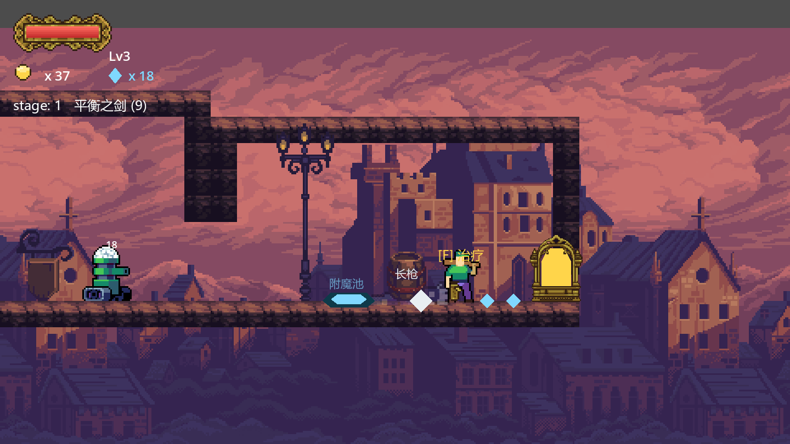
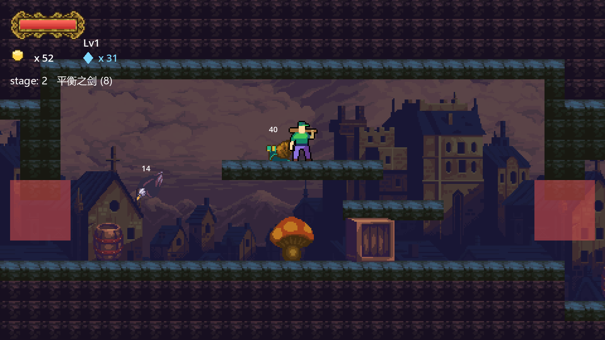
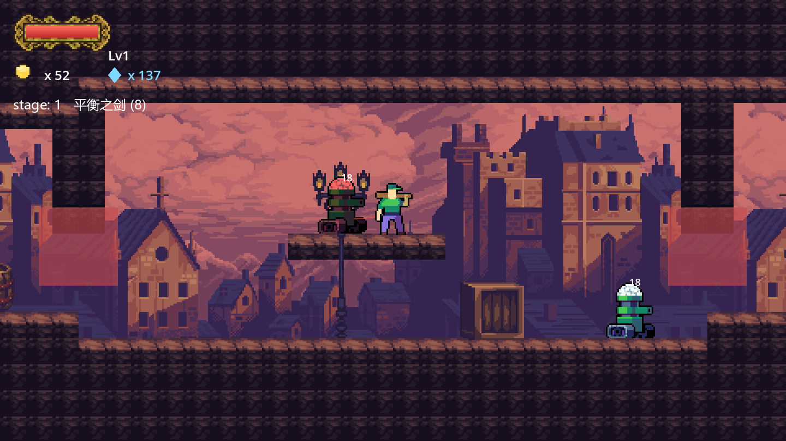

# Pixel Roguelite

A Dead Cells-inspired 2D pixel-art action roguelite built in **Godot 4.7** (GDScript).
Procedurally generated stages, momentum combat, three rotating biomes, boss fights,
a shard-driven enchant economy, and a persistent weapon-unlock meta loop.

## Play

Open `project.godot` in Godot 4.7+ and press F5.

Or grab a prebuilt `pixel-roguelite.exe` from **Releases** (Windows x86_64, single file).

## Controls

| Input | Action |
|---|---|
| A / D | Move |
| Space | Jump (double jump) |
| J | Attack (3-hit combo chains) |
| K / Shift | Roll (i-frames, breaks crates) |
| F | Interact (pickups, shop, enchant pool, boss door) |
| Long-press F | Dismantle weapon pickups into shards |
| 1 / 2 / 3 | Buy enchant ranks at the enchant pool |
| Esc | Pause · F3 debug overlay |

## What's inside

- **Movement kit**: coyote time, jump buffering, jump-cut, wall slide/jump, ledge climb, roll i-frames.
- **Procedural stages**: ASCII-map room chunks + critical-path generator, seeded runs, door lockdowns, a boss room with a right-wall portal.
- **3 biomes** (town / cave / sewer) rotating per stage, with per-biome tile palettes and enemy overrides.
- **6 enemy archetypes** (rat, spitter, heavy, eagle, slug, piranha plant) + **4 rotating bosses** (Gatekeeper, Hexcaster, Street Stray, Helidrone) with phase-2 enrages.
- **6 data-driven weapons** with a permanent unlock pool (buy at shops or on the death screen), weapon swapping, and long-press dismantling.
- **Economy**: coins (treasure → shop/meta unlocks) and shards (crates/bosses → enchant pool: attack speed / lifesteal / move speed with shared price escalation).
- **Run progression**: kill XP and levels, timed crate buffs, mushroom springs, destructible props with enemy-damaging blasts.
- Chinese item prompts (system-font CJK with fallbacks), Kenney/freesound audio, PIL-generated tile variants.

## Dev

- Docs: `docs/ARCHITECTURE.md` (framework), `docs/HANDOFF.md` (status + gotchas).
- Headless tests in `tools/` — run each with
  `Godot_v4.7.1-stable_win64_console.exe --headless --path . --script res://tools/<name>_test.gd`
  (smoke / climb / combat / generator / stage / enemy / prop / drops / weapon_pool / boss / spring / biome / meta).

## Credits

- Art: craftpix packs (GothicVania town, Free City fighters, OutlinedRat, Sunny Land, Gothic Pixel UI)
- Audio: freesound.org (velcronator), Kenney Impact Sounds (CC0)
- Engine: Godot 4 (MIT)
